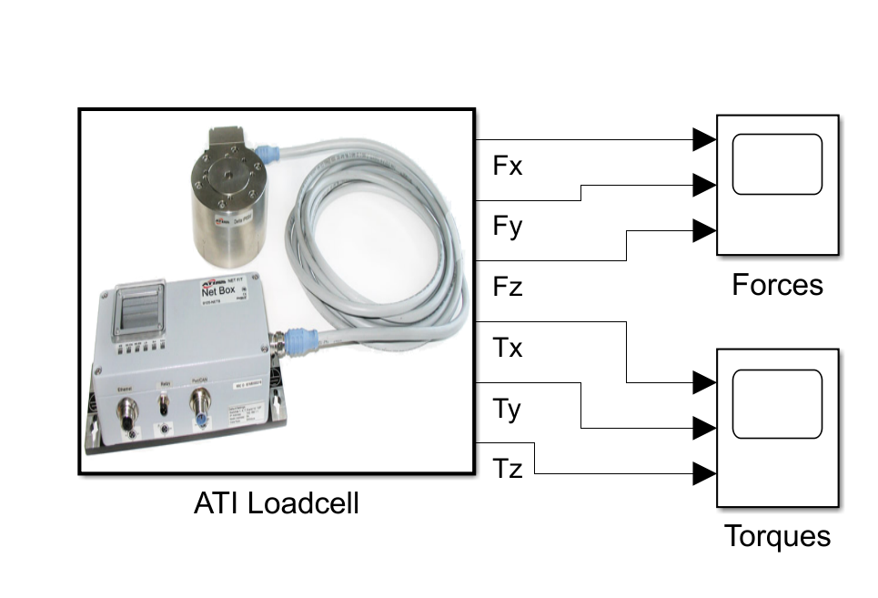

# Matlab Simulink Interface for ATI NetF/T Sensors
This library provides an interface to sample data from ATI Net-FT sensors directly within Simulink. It allows seamless integration for real-time data collection and simulation, enabling users to utilize ATI's force/torque sensors in their Simulink models for testing.

Tested in Matlab R2023a.

## Setup

### Prerequisites
- MATLAB (Tested in R2023a)
- Simulink
- Simscape (if necessary for your model)

### TCP/IPv4 settings on your machine:
- Static IP: `192.168.1.100`
- Submask: `255.255.255.0`
- NetFT box IP: `192.168.1.1`

## ATI user Manual
User manual: http://www.ati-ia.com/app_content/documents/9610-05-1022%20Quick%20Start.pdf

## Previous Developers
Lukas Kaul
https://github.com/LuSeKa/ATI_NetFT_MatlabInterface

Min-Geun Park
https://github.com/geunee20/ATI_NetFT_MatlabInterface/tree/2021b

## Cite as
@software{Dukkipati_2024,
author = {Dukkipati, Siril Teja},
license = {MIT},
month = nov,
title = {{Matlab Simulink Interface for ATI NetF/T Sensors}},
url = {https://github.com/siril-teja/ATI_NetFT_SimulinkInterface.git},
year = {2024}
}